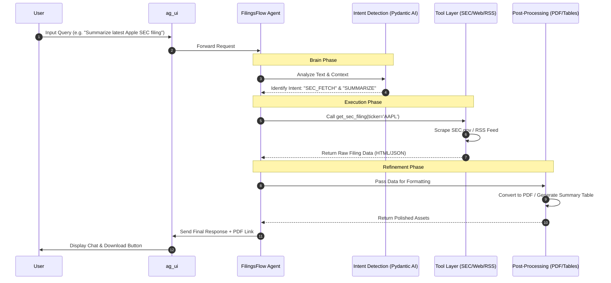

# FinResearch Agent

**FinResearch Agent** is a tool-augmented financial research and intelligence agent.
It autonomously researches **regulatory filings, financial news, and market data**, and presents structured, auditable insights through a conversational interface.

The system is designed around an **agent-first architecture**, where reasoning, tool orchestration, and safety controls are core principles.

This project is intended for **personal research and experimentation**, not as a public financial advisory product.

---

## What FinResearch Agent Does

FinResearch Agent can:

- Understand user intent from natural-language financial queries
- Research and analyze **regulatory filings** (e.g., SEC filings)
- Fetch, download, and process filings in raw formats
- Convert filings into **readable PDFs on demand**
- Read and summarize long financial and regulatory documents
- Track and summarize **financial and market news**
- Retrieve **market prices, volume, and historical performance**
- Compare assets across multiple time horizons
- Provide **data-driven financial insights with clear disclaimers**
- Maintain conversational memory across interactions
- Produce a full audit trail of reasoning and tool usage

---

## Technology Stack

- **Backend:** FastAPI
- **Agent Framework:** PydanticAI
- **UI Layer:** ag_ui 

### Data Sources
- SEC RSS feeds, APIs, and raw filing downloads
- Yahoo Finance RSS
- Seeking Alpha RSS
- NSE RSS feeds

---

## High-Level Architecture

**Key characteristics**
- Single conversational agent with multiple tools
- Central orchestrator controls all tool execution
- Conversation memory enabled
- Full audit and traceability for every request

---

## Development Roadmap (TODO)

### Phase 0 — Foundation
- [ ] Initialize FastAPI project
- [ ] Integrate PydanticAI
- [ ] Integrate ag_ui
- [ ] Environment configuration
- [ ] Structured logging setup

---

### Phase 1 — Core Chat Agent
- [ ] Create base FinResearch Agent with finance-safe system prompt
- [ ] Enable conversation memory
- [ ] Implement `/chat` API endpoint
- [ ] Log user inputs and agent outputs

---

### Phase 2 — Intent Detection
- [ ] Define intent schema (filings, news, market data, research, guidance)
- [ ] Implement LLM-based intent classification
- [ ] Extract entities (company, ticker, filing type)
- [ ] Attach confidence scoring and logging

---

### Phase 3 — Orchestrator Layer
- [ ] Build central orchestration logic
- [ ] Route intents to appropriate tools
- [ ] Support multi-step reasoning flows
- [ ] Implement safe fallbacks on failures

---

### Phase 4 — Regulatory Filings Research
- [ ] Ingest SEC RSS feeds
- [ ] Discover latest filings
- [ ] Download raw filings (HTML / TXT)
- [ ] Generate PDFs on explicit request
- [ ] Summarize filings (full and section-wise)

---

### Phase 5 — Financial News Research
- [ ] Integrate Yahoo Finance RSS
- [ ] Integrate Seeking Alpha RSS
- [ ] Integrate NSE RSS
- [ ] Deduplicate and rank news articles
- [ ] Generate research-grade summaries

---

### Phase 6 — Market Data & Analysis
- [ ] Integrate free market data APIs
- [ ] Fetch price and volume data
- [ ] Compute historical performance (1M / 1Y / 5Y)
- [ ] Generate comparison tables and rankings

---

### Phase 7 — Guarded Financial Insights
- [ ] Apply investment-related disclaimers
- [ ] Block high-risk or promissory advice
- [ ] Provide data-driven, neutral insights
- [ ] Enforce safe language constraints

---

### Phase 8 — Output Formatting
- [ ] Plain-text analytical responses
- [ ] Tabular data presentation
- [ ] PDF download links via chat
- [ ] Automatic output format selection

---

### Phase 9 — Safety, Audit & Observability
- [ ] Full tool-call audit trail
- [ ] Error and exception logging
- [ ] Unsafe query detection and redirection
- [ ] Traceable execution records

---

## Disclaimer

FinResearch Agent provides **informational and research-oriented content only**.  
It does **not** offer investment, legal, or financial advice.  
All insights are based on **publicly available and historical data**.

---

## Project Status

🚧 Active development — features are added incrementally.
